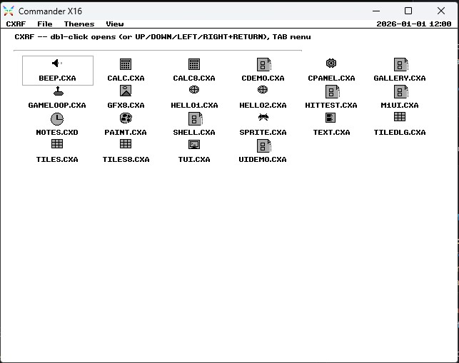
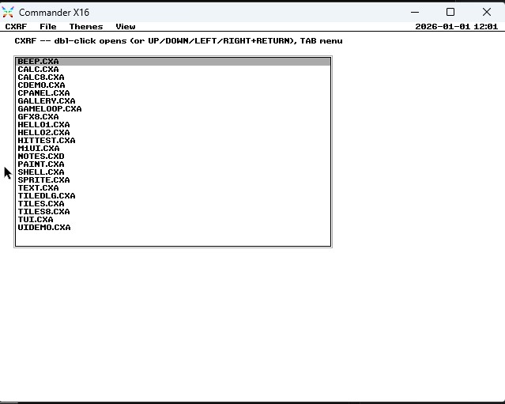
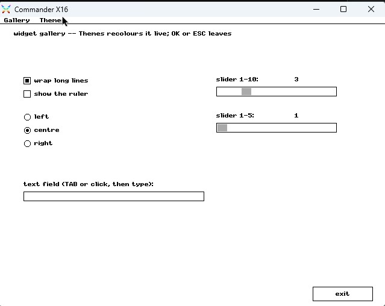
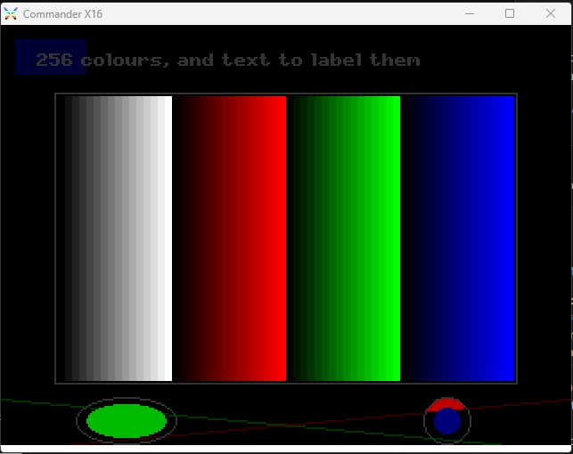

# CXRF - Commander X16 Runtime Framework

## About CXRF

**CXRF (Commander X16 Runtime Framework)** is a comprehensive application framework for the Commander X16 retro computer that enables developers to build rich, interactive software with a modern development experience while maintaining the authenticity of 8-bit programming.

## Dual-Mode Deployment

CXRF is uniquely designed to support two powerful usage models:

### 1. Desktop Environment

Launch applications through an integrated desktop interface. CXRF provides a central hub where users can browse, launch, and manage CXRF-based programs without needing to understand system-level details. Similar to classic environments like GEOS for Commodore 64, CXRF presents a unified application ecosystem with a consistent user experience.

### 2. Standalone Deployment

Package CXRF applications as self-contained executables that run independently on any Commander X16 system. Developers can bundle their programs with the CXRF runtime, eliminating dependencies and distribution hassles. Users run standalone CXRF programs directly—no desktop required.

## Why CXRF?

- **Flexible Deployment**: Choose how your application is distributed—through the desktop or as a standalone program
- **Consistent Experience**: CXRF provides a unified API and runtime environment whether running from the desktop or standalone
- **Developer-Friendly**: Modern tools and workflows without sacrificing X16 authenticity
- **User-Friendly**: A polished interface for end-users whether they prefer a desktop environment or direct program execution




## Guides

Full documentation lives in [docs/](docs/).

**Start here**
- [docs/memory-map.md](docs/memory-map.md) — the live ledger of contended address space (shareable one-page reference: [HTML](docs/memory-map.html) · [PDF](docs/memory-map.pdf))
- [docs/devguide.md](docs/devguide.md) — VS Code setup, build a `.CXA` app, deploy to emulator or SD card
- [docs/sdkguide.md](docs/sdkguide.md) — the generated low-level ABI header (what every app ultimately calls)
- [docs/graphics-port.md](docs/graphics-port.md) — the pluggable video modes and how the port works

**SDKs (pick your toolchain)**
- [docs/csdkguide.md](docs/csdkguide.md) — C wrapper, typed `cx_*` calls (`csdk/cxsdk.h`)
- [docs/asmsdkguide.md](docs/asmsdkguide.md) — ca65 `cxm_*` macros (`asmsdk/ca65/cxrf.inc`)
- [docs/p8sdkguide.md](docs/p8sdkguide.md) — Prog8 `cx` binding + `ui` block

**Going deeper**
- [docs/gameguide.md](docs/gameguide.md) — tile mode: colour depth, tileset placement, VRAM vs bank RAM
- [docs/ui.md](docs/ui.md) — where widgets/menus/dialogs live, and why
- [docs/banks.md](docs/banks.md) — kernel code layout; how to add a widget, shape, bank, or ABI slot
- [docs/formats.md](docs/formats.md) — file formats (CXF fonts, assets)
- [docs/remap.md](docs/remap.md) — the 8bpp-tile VRAM/bank restructure (v0.9.0)
- [docs/perf.md](docs/perf.md) — Phase 0 spike measurements

## Highlights

- **Four video modes** behind one pluggable graphics port (`cx_mode(mode, bpp)`) — same drawing calls, reinterpreted per canvas:
  - `CX_MODE_BMPHIGH` — the **640×480** umbrella: **bpp 2** is the 4-colour desktop on standard VERA; **bpp 4 / 8** (16 / 256 colours) light up the **VERA_2 second plane**, each with its own palette (emulator: needs `-bitmap2`)
  - `CX_MODE_BMPLOW` — 320×240 bitmap at **8 / 4 / 2 bpp** (256 / 16 / 4 colours), full primitive set, programmable palette
  - `CX_MODE_TILE` — two 64×32 VERA tile layers, hardware scrolling (`cx_tile_*`); bpp 8 or 4 per layer
  - `CX_MODE_TEXT` — 80×60 text cells "like BASIC": colour fills, PETSCII box frames, ruled lines, mixed-case `cx_say`
- Sprites, audio, events, joysticks, files, widgets and dialogs work in every mode.
- **Stock ROM (R49+)** — boots from SD via `AUTOBOOT.X16` or from a **cartridge** (`build.ps1 -Cart`, ROM banks 32–36). No ROM patches.
- **Native CMDR-DOS FAT32 files** .
- **Apps in any toolchain** — fixed jump-table ABI with generated bindings for 7 assemblers, 5 C compilers, and Prog8.
- **A documented SDK** — friendly `cx_*` / `cxm_*` / `ui` wrappers over graphics, text, events, widgets, dialogs, themes, files, clipboard, audio (VERA PSG, YM2151 FM, streamed PCM), sprites, joysticks, shapes, and pluggable fonts/charsets.
- Built on [X16_Library](https://github.com/vinej/x16_library) — the kernel vendors the ca65 edition (`x16lib/`).

**Pre-1.0 contract change:** RAM banks 16–19 now belong to the kernel; the first app bank (and `cx_bload` floor) moved from 16 to **20**.

## Layout

```
kernel/           the OS: boot, resident core, gfx2, fonts, events, ui, shell, fs
x16lib/           vendored x16_library src_ca65 tree (pinned)
abi/              jump-table manifest + binding generator
sdk/              GENERATED bindings, one per toolchain (committed)
csdk/             friendly C wrapper over the ABI (cx_* functions)
asmsdk/ca65/      friendly ca65 macro layer over the ABI (cxm_* macros)
p8sdk/            friendly Prog8 layer (ui block)
apps/             system applications and desk accessories
spikes/           Phase 0 throwaway risk prototypes
tools/            font converter, SD-image builder, CXAP wrapper
test/             on-target regression suites
docs/             the guides (indexed above)
```

## Building

Repo-local tools, never committed:

- `cc65\ca65.exe` + `cc65\ld65.exe` — from [cc65](https://cc65.github.io/)
- `emulator\x16emu.exe` + SDL DLLs — from [x16-emulator](https://github.com/X16Community/x16-emulator)
- `emulator\rom.bin` — **the official stock R49 ROM only**, from the
  [x16-rom r49 release](https://github.com/X16Community/x16-rom/releases/tag/r49),
  sha256 `b81654cc8c87ed96e3ffc7c8e7c312c9f3b7b870c7bb34de61e61eac931b819a`.
  Do NOT reuse the GEOS-modified ROM from sibling projects (sha256 `298e3e2a…`);
  CXRF's whole premise is running on stock ROM.

```powershell
.\build.ps1 -Source spikes\spike_a.asm      # assemble one program
.\build.ps1 -Source spikes\spike_a.asm -Run # ... and run it windowed
.\build.ps1 -Test                           # unit suite + boot smoke, headless
.\build.ps1 -Kernel                         # the resident image, CXKERNEL.PRG
.\build.ps1 -Apps                           # AUTOBOOT.X16, the shell, the hellos
.\build.ps1 -Image                          # ...staged as a bootable root in build\sdroot
.\build.ps1 -Boot                           # ...and booted, windowed, to play with
```

- C apps want llvm-mos (via `LLVM_MOS_HOME`, sibling `x16_clib\llvm-mos`, or `C:\llvm-mos`); without it the C hello is skipped and everything else still builds.
- `-Test` ends with the boot smoke: a staged SD root boots for real and runs `test\canary\CANARY.CXA` (the **ABI freeze test**) plus each hello. Don't rebuild the canary casually — that is a release act.

## ABI — the app/kernel contract

**ABI** = **Application Binary Interface**: the *binary-level* contract between
apps and the kernel (as opposed to an API, which is the source-level one). It
pins down what both sides must agree on to call across the boundary:

- **Where entry points live** — a **fixed jump table** (currently **ABI v4, 105 slots**)
- **How arguments/returns pass** — a shared parameter block (`X16_P0..P7`)
- **What is preserved vs. clobbered**, and the **layout** of data crossed at the boundary

Why it matters here:

- **Toolchain-agnostic** — every app calls the same slots, whether built with one of the 7 assemblers, 5 C compilers, or Prog8. Bindings are generated, not hand-written.
- **Forward-stable** — slots never move, so an app compiled today keeps working against a later kernel. New features append new slots; they never renumber old ones.
- **Guarded** — the **ABI freeze test** (`test\canary\CANARY.CXA`) is a binary built from an old SDK; if any slot shifts, it breaks at boot and the boot smoke catches it. Rebuilding the canary is a release act, not a casual one.

Where it lives:

- [abi/](abi/) — the jump-table manifest + binding generator
- [sdk/](sdk/) — generated low-level bindings, one per toolchain (committed)
- [docs/sdkguide.md](docs/sdkguide.md) — the generated ABI header explained
- [docs/banks.md](docs/banks.md) — how to add a new ABI slot without reshuffling anything

## Vendored X16_Library  under /x16lib folder

`x16lib/` is a clean snapshot of `x16_library/src_ca65/` at **v0.11.9**. Update
it by re-copying the tree and noting the new version here. The kernel opts into
`X16_SKIP_SHAPES`/`X16_SKIP_MATH` (it places the shape/trig modules in its own
banks), and the bitmap engines (`bitmap2h.asm` = `gfx2h_*`, `bitmap8l.asm` =
`gfx8l_*`, and the newer `bitmap4l`/`bitmap2l`/`bitmap4h`/`bitmap8h`) are
`.include`d directly into their overlay banks rather than through
`X16_USE_BITMAP*`, so only their VERA / VERAFX `_FILL` helpers land in the
resident budget. Several upstreamable gates carry CXRF's needs, all now in
`x16_library`: `X16_SKIP_BASE` (shapes.asm, so the base shapes can be
`.include`d a second time for the extras bank), and the `_NO_INIT` / `_MIN`
gates on `bitmap8l` / `bitmap4l` / `bitmap2l` — so a port that programs VERA
itself and wants only the core drawing entries does not drag in
`screen_set_mode` or the 8×8 glyph blitter, and the images fit the 2,304 B
graphics-port window. (v0.11.2 also fixed an `acme2ca65` lone-label bug those
newer bitmap modules surfaced; v0.11.7 fixed `gfx4l_setptr` computing the wrong
VRAM row address on odd rows — 4bpp low-res rendered as a comb of stripes;
v0.11.9 fixed `gfx4l_line` reading its 8-bit y as 16-bit — vertical/diagonal
`cx_line` and the circle/ellipse outlines drew garbage.) No local patches: the
tree is a plain snapshot.

## License

[MIT](LICENSE) © Jean-Yves Vinet. The vendored `x16lib/` tree keeps its own
upstream [x16_library](https://github.com/vinej/x16_library) license; the stock
ROM and emulator are third-party and not distributed here (see Building).






