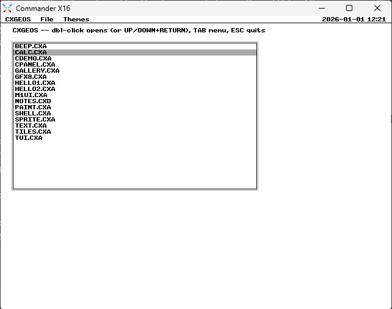

# CXGEOS

V0.7.0 — **invisible hit regions and a palette API**. A new `WG_HIT` widget is
a hotspot the app draws itself — rectangle, circle or ellipse — while the
toolkit only routes the mouse (click, release, hover), making any shape
clickable for zero resident bytes. `cx_pal_set` / `cx_pal_load` program VERA's
256-colour palette directly; the desktop remembers its list-vs-icons view
across an app launch; and re-vendoring x16lib's optimized gfx trimmed ~600 B
of banked kernel code. The C SDK now wraps all 99 ABI slots.
(v0.6.1 added a **graphical icon widget and an icon-view desktop** plus
sprite-collision capture; v0.6.0 rebuilt the **memory architecture for
growth** — kernel code themed one purpose per bank across two loadable files,
banks 2–5 + 16–19; see [docs/banks.md](docs/banks.md).) See /docs for the
guides.

A from-scratch, GEOS-inspired graphical desktop OS for the Commander X16.

  **four video modes** behind a pluggable graphics port (`cx_mode`, see
  [docs/graphics-port.md](docs/graphics-port.md)) — the same drawing
  calls, reinterpreted per canvas:
  - **mode 0** `CX_MODE_GUI` — the 640×480 4-colour desktop above;
  - **mode 1** `CX_MODE_BMP8` — a 320×240 **256-colour** bitmap with the
    full primitive set (pset/read, spans, rects, lines, patterns, blits)
    and the palette yours to program;
  - **mode 2** `CX_MODE_TILE` — two 64×32 VERA **tile layers** with
    hardware scrolling (`cx_tile_*`), the game personality;
  - **mode 3** `CX_MODE_TEXT` — **80×60 text cells** "like BASIC":
    colour fills, PETSCII **box-glyph frames** (┌─┐│└┘), ruled
    `cx_hline`/`cx_vline`/`cx_line`, and mixed-case `cx_say`.

  Sprites, audio, events, joysticks, files and the **shapes**
  (circle/disc/flood, and ellipses) work in every mode; the
  widget toolkit, fonts and dialogs are desktop-only and refuse politely
  elsewhere.
- **Stock ROM (R49+)**: boots from the SD card via `AUTOBOOT.X16`, or from a
  **cartridge** (`build.ps1 -Cart`, ROM banks 32–36, the KERNAL's `"CX16"`
  auto-boot) — no ROM patches either way. The boot set is four files that
  travel together — `AUTOBOOT.X16`, `CXKERNEL.PRG`, `CXBANKS.BIN`,
  `CXBANKS2.BIN` — and stage-0 verifies a build word across all of them, so
  a card carrying yesterday's copy of one refuses at boot with a message.
  **Pre-1.0 contract change**: RAM banks 16–19 now belong to the kernel;
  the first app bank (and `cx_bload` floor) moved from 16 to **20**.
- **Native CMDR-DOS FAT32 files** — no .d64 images, no disk swapping.
- **Apps in any toolchain**: a GEOS-style fixed jump-table ABI with generated
  bindings for 7 assemblers (ACME, ca65, 64tass, KickAssembler, dasm, MADS,
  vasm) and 5 C compilers (cc65, llvm-mos, KickC, Oscar64, vbcc).
- **A documented SDK**: friendly wrappers over the ABI — a header-only **C**
  wrapper (`csdk/`, typed `cx_*` calls) and a **ca65 macro** layer
  (`asmsdk/ca65/`, one-line `cxm_*` macros that pack the parameter block for
  you and read byte-identical to hand code). Both cover graphics, text, events,
  widgets, dialogs, themes, files, clipboard, **audio** (VERA PSG, the YM2151
  FM chip, streamed PCM) and **hardware sprites**, (0.3.0) **joysticks**, the
  four video modes above, and the mode-agnostic **shapes**, and **pluggable
  fonts and charsets**, the **asset loaders** (`cx_file_load`, and
  `cx_vload`/`cx_bload` for the VLOAD-shaped binaries every X16 graphics
  tool exports), **mode-1 text** with `cx_ink`, and the **event source
  mask**. Music loads today (ZSM via `cx_bload`); a zsmkit-based player
  is planned, not in yet. Guides in
  [docs/sdkguide.md](docs/sdkguide.md), [docs/csdkguide.md](docs/csdkguide.md),
  [docs/asmsdkguide.md](docs/asmsdkguide.md)
  and [docs/graphics-port.md](docs/graphics-port.md); the kernel's bank
  layout and how to extend it in [docs/banks.md](docs/banks.md).
- Foundationed on [x16lib](https://github.com/vinej/x16_library): the kernel
  vendors the ca65 edition (`x16lib/`, byte-identical to the ACME reference,
  same on-target test suite).

## Layout

```
kernel/           the OS: boot, resident core, gfx2, fonts, events, ui, shell, fs
x16lib/           vendored x16_library src_ca65 tree (pinned; see below)
abi/              jump-table manifest + binding generator
sdk/              GENERATED bindings, one per toolchain (committed)
csdk/             friendly C wrapper over the ABI (cx_* functions)
asmsdk/ca65/      friendly ca65 macro layer over the ABI (cxm_* macros)
apps/             system applications and desk accessories
spikes/           Phase 0 throwaway risk prototypes (perf numbers in docs/perf.md)
tools/            font converter, SD-image builder, CXAP wrapper
test/             on-target regression suites (x16lib runner pattern)
docs/             the guides: graphics-port, sdk, csdk, asmsdk, formats, memory-map, perf, ui
```

## Building

Repo-local tools, never committed:

- `cc65\ca65.exe` + `cc65\ld65.exe` — from [cc65](https://cc65.github.io/)
- `emulator\x16emu.exe` + SDL DLLs — from
  [x16-emulator](https://github.com/X16Community/x16-emulator)
- `emulator\rom.bin` — **the official stock R49 ROM only**, from the
  [x16-rom r49 release](https://github.com/X16Community/x16-rom/releases/tag/r49),
  sha256 `b81654cc8c87ed96e3ffc7c8e7c312c9f3b7b870c7bb34de61e61eac931b819a`.
  Do NOT copy `rom.bin` from the sibling `X16_Geos` or `x16_library`
  projects: those carry a GEOS-modified ROM under the stock name
  (sha256 `298e3e2a…`). CXGEOS's whole premise is running on stock ROM.

```powershell
.\build.ps1 -Source spikes\spike_a.asm      # assemble one program
.\build.ps1 -Source spikes\spike_a.asm -Run # ... and run it windowed
.\build.ps1 -Test                           # unit suite + the boot smoke, headless
.\build.ps1 -Kernel                         # the resident image, CXKERNEL.PRG
.\build.ps1 -Apps                           # AUTOBOOT.X16, the shell, the hellos
.\build.ps1 -Image                          # ...staged as a bootable root in build\sdroot
.\build.ps1 -Boot                           # ...and booted, windowed, to play with
```

C apps want llvm-mos (found via `LLVM_MOS_HOME`, the sibling
`x16_clib\llvm-mos`, or `C:\llvm-mos`); without it the C hello is
skipped and everything else still builds.

`-Test` ends with the boot smoke: a staged SD root boots for real —
stage-0, kernel, font — and then runs three chains to the shell:
`test\canary\CANARY.CXA` (the **ABI freeze test**: a committed binary
built from the sdk of the day the ABI shipped, run against the kernel
built seconds ago — if a slot ever moves, the past breaks here first),
then each hello, which draws, waits three seconds, and leaves through
`cx_exit`. Do not rebuild the canary casually; that is a release act.

## Vendored x16lib

`x16lib/` is a snapshot of `x16_library/src_ca65/` at **v0.7.0** (1a8077c:
a gfx size pass — `bitmap`/`bitmap2`/`shapes` reworked smaller and a
LINE-only `VERAFX` build fixed — which trimmed ~600 B of banked kernel code
when re-vendored; on top of v0.6.1's finer `_CORE` module gates that take
each module's core and drop what the kernel never calls). The 64tass
value-gate model is generated by the converter, not hand-maintained.
Update it by re-copying the tree and noting the new version here.

The kernel gates `X16_USE_BITMAP2`, which asks VERAFX for
`_FILL` alone rather than all 2.5 KB of it. That is worth 2,162 bytes of
the resident budget and is why the image fits.


## License

[MIT](LICENSE) © Jean-Yves Vinet. The vendored `x16lib/` tree keeps its own
upstream [x16_library](https://github.com/vinej/x16_library) license; the
stock ROM and the emulator are third-party and not distributed here (see
Building).


